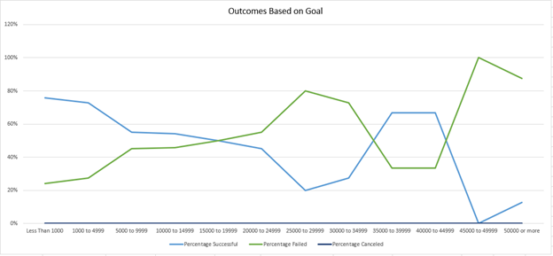

# kickstarter-analysis
## **Project Overview**
  For this project, we were tasked with identifying the campaigns outcomes based on their launch dates and their outcomes based on goals. We will complete this with the ‘starterbook’ excel sheet that we began with and creating pivot tables and using key functions that we have been working on in the week. 

## **Analysis and challenges**
### Deliverable 1
For the first deliverable: outcomes based on launch date we created a column “years” by using the =years() function. Next we created a pivot table to show the outcomes by launch dates with a filter to show the information for just theaters.

Furthermore, we modified rows to show the months of the year as well as sorted in a descending order. Lastly, we created a line chart showing the count of successful, failed, or canceled projects by month. 

### Deliverable 2
For deliverable 2 we created another sheet to track the outcomes based on goal. We used the countifs() function to pull the information to populate the number of successful, failed, canceled columns. Next, we used the sum() function to add the counts of the successful, failed, canceled columns to populate the total projects column. Furthermore, we divided the initial columns by the total projects columns to calculate the percentages. Lastly, we made a line chart to track the rates against the goals. 

## **Results**
Reviewing the data, it looks like there was no canceled theater shows in the month of October. Another outcome shown was that may had the most viewings for theater. A key takeaway from the “outcomes based on goal” graph is that there is an inversed relationship between successful and failed. One recommendation I would make to add to this analysis would be to compare successes by country to identify which regions are more successful. Also would be interesting to compare the pledged against whether it was a staff pick to see if staff picks had more money pledged to them. 
